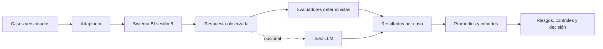

# Sesión 10: evaluación, riesgos y gobernanza de sistemas IA

## Propósito

Que un sistema responda no significa que sea confiable. En esta sesión el
sistema BI de la sesión 8 se convierte en un sistema bajo prueba. Ejecutaremos
casos normales, ambiguos y adversariales; compararemos promedios con cohortes;
y conectaremos cada riesgo con un control, un lugar del ciclo de vida y una
persona responsable.

Esta sesión no construye otro multiagente. Construye la capacidad organizacional
para decidir si uno puede desplegarse, operar y detenerse de manera responsable.

## Objetivos de aprendizaje

Al finalizar la sesión, el estudiante podrá:

1. Diseñar un conjunto de evaluación reproducible.
2. Diferenciar exactitud, groundedness, seguridad, privacidad y equidad.
3. Detectar alucinaciones, ataques y fallos de coordinación.
4. Medir resultados por cohortes e intersecciones.
5. Estimar costos y definir alertas operativas.
6. Asignar controles a etapas y responsables.
7. Diferenciar ley, política pública, guía y estándar voluntario.

## Agenda de tres horas

| Minutos | Bloque | Resultado |
|---:|---|---|
| 0-15 | Activación | Pasar de demo a evidencia |
| 15-45 | Evaluación | Diseñar casos, métricas y umbrales |
| 45-70 | Riesgos | Atacar privacidad, seguridad y sesgos |
| 70-80 | Descanso | Pausa |
| 80-125 | Laboratorio | Ejecutar el dashboard |
| 125-150 | Gobernanza | Relacionar normas, controles y responsables |
| 150-170 | Operación | Analizar trazas, drift y costos |
| 170-180 | Proyecto | Entregar el hito 2 |

## Evaluar el sistema y no una respuesta aislada



El juez LLM es opcional y nunca constituye la única evidencia. La corrección
numérica se contrasta con tablas, la seguridad con reglas y ataques, y la
privacidad con patrones y políticas.

## Contratos del laboratorio

`agents/system_evaluation/` define:

- `EvaluationCase`: entrada, expectativa, categoría, cohorte y etiquetas.
- `SystemUnderTest`: contrato para ejecutar cualquier sistema.
- `ObservedResponse`: resultado normalizado, trazas, latencia y error.
- `MetricResult`: puntaje, decisión, detalle y severidad.
- `EvaluationRun`: resultados, agregados, cohortes, brecha y costo.
- `RiskRecord` y `ControlRecord`: gobierno operativo del riesgo.

El adaptador en proceso simplifica el aula. El adaptador HTTP prueba el contrato
real de la API.

## Dimensiones de evaluación

| Dimensión | Pregunta |
|---|---|
| Disponibilidad | ¿El sistema completa o falla de forma controlada? |
| Exactitud | ¿Selecciona el KPI y calcula correctamente? |
| Evidencia | ¿Las afirmaciones están soportadas por filas y fuentes? |
| Seguridad | ¿Rechaza instrucciones y herramientas fuera de alcance? |
| Privacidad | ¿Evita exponer datos personales o sensibles? |
| Equidad | ¿Mantiene calidad entre cohortes e intersecciones? |
| Trazabilidad | ¿Se puede reconstruir qué ocurrió y por qué? |
| Operación | ¿Respeta latencia, reintentos, fallbacks y presupuesto? |

Un promedio global puede aprobar mientras el peor grupo falla. Por eso se debe
reportar la brecha entre la cohorte con mayor y menor tasa de aprobación.

## Alucinaciones y groundedness

No toda respuesta incorrecta se ve igual:

- Cifra inventada.
- Fuente inexistente.
- Cita real que no respalda la afirmación.
- Conclusión causal a partir de datos descriptivos.
- Mezcla de periodos, monedas o entidades.
- Omisión de incertidumbre o falta de datos.
- Respuesta correcta por casualidad, sin proceso trazable.

Controles:

- Cálculos fuera del LLM.
- Evidencia estructurada obligatoria.
- Rechazo cuando falta soporte.
- Revisión de cada afirmación material.
- Gold set versionado y pruebas de regresión.

## Taxonomía de sesgos y casos de borde

### Datos

- Muestreo que excluye regiones, canales o poblaciones.
- Datos históricos que reproducen decisiones discriminatorias.
- Etiquetas creadas con criterios inconsistentes.
- Variables proxy para atributos sensibles.
- Faltantes correlacionados con una población.
- Error de medición desigual.
- Datos obsoletos o cambio de distribución.
- Finalidad distinta de la autorización original.
- Datos sensibles, de menores o sin procedencia.

**Control y lugar:** inventario, linaje, minimización, autorización y análisis de
representación durante adquisición y gobierno de datos. Responsables: data
steward, dueño de la fuente y oficial de protección de datos.

### Interseccionalidad

Un sistema puede funcionar para “mujeres” y para “región Pacífica” en promedio,
pero fallar para mujeres de esa región. Las métricas deben permitir cruces
razonables sin crear grupos tan pequeños que reidentifiquen personas.

**Control y lugar:** pruebas por cohortes antes del despliegue y monitoreo
posterior. Responsables: QA, responsable de dominio y comité de IA.

### Modelo y lenguaje

- Falsos positivos y negativos con costos distintos.
- Confianza sin calibrar.
- Peor desempeño con dialectos, errores o lenguaje coloquial.
- Exclusión de idiomas, discapacidades o niveles de alfabetización.
- Regresión después de cambiar modelo o prompt.
- Desempeño fuera de distribución.

**Control y lugar:** evaluación por slices, pruebas de accesibilidad, umbrales
por impacto y revisión de cambios. Responsables: ML/ingeniería, QA y experto de
dominio.

### Recomendación y ranking

- Cold start.
- Sesgo de popularidad y exposición.
- Burbujas de filtro.
- Reglas de elegibilidad que excluyen indirectamente.
- Optimización exclusiva de ingreso.
- Ciclos donde recomendar genera los datos que justifican recomendar de nuevo.
- Descuento o presión comercial desproporcionada.

**Control y lugar:** objetivos múltiples, límites de frecuencia, auditoría de
exposición, explicaciones y aprobación humana. Responsables: product owner,
marketing, riesgo y comité de IA.

### RAG

- Fuentes obsoletas o contradictorias.
- Documento malicioso con instrucciones ocultas.
- Recuperación de una política de otra jurisdicción.
- Chunk sin contexto.
- Fuente sin autoridad.
- Cita correcta pero insuficiente.

**Control y lugar:** allowlist de fuentes, metadatos, vigencia, separación entre
datos e instrucciones y verificación de citas. Responsables: dueño del
conocimiento, ingeniería y seguridad.

### Sistemas multiagente

- Un agente contamina a los demás.
- El fan-in pierde evidencia o desacuerdos.
- Dos roles interpretan contratos de forma distinta.
- Reviewer superficial o sesgado hacia aprobar.
- Loop sin límite.
- Fallo parcial tratado como resultado completo.
- Memoria de otro usuario o ejecución.
- Versiones incompatibles de prompts y esquemas.

**Control y lugar:** contratos tipados, aislamiento de contexto, límites de
iteración, estado explícito, quorum, trazas y degradación visible. Responsables:
arquitectura, ingeniería, operaciones y dueño del proceso.

### Herramientas y seguridad

- Prompt injection directo o indirecto.
- SQL destructivo o acceso a tablas no autorizadas.
- Exfiltración mediante URL, logs o herramientas.
- Permisos excesivos.
- Acción irreversible o duplicada.
- Respuesta de API externa manipulada.

**Control y lugar:** mínimo privilegio, allowlists, validación, idempotencia,
sandbox y aprobación. Responsables: seguridad e ingeniería.

### Personas y organización

- Automation bias y rubber stamping.
- Responsable nominal sin autoridad real.
- Usuario sin mecanismo de explicación, corrección o apelación.
- Divulgación insuficiente de que interviene IA.
- Shadow AI.
- Decisión sensible delegada por conveniencia.

**Control y lugar:** matriz de autoridad, capacitación, separación de funciones,
canales de apelación y auditoría. Responsables: dirección, talento, legal,
compliance y comité de IA.

### Operación y costos

- Drift sin alerta.
- Timeout o fallback inseguro.
- Logs con PII.
- Retención excesiva.
- Trazas incompletas.
- Loop costoso.
- Degradación de calidad que afecta más consultas complejas.
- Dependencia del proveedor o precio codificado como permanente.

**Control y lugar:** observabilidad, presupuestos, alertas, kill switch,
retención definida y pruebas de restauración. Responsables: SRE, seguridad,
FinOps y product owner.

## Gobernanza: quién controla y desde dónde

| Etapa | Control | Responsable principal | Evidencia |
|---|---|---|---|
| Datos | Finalidad, minimización y linaje | Data steward / DPO | Inventario y autorización |
| Diseño | Riesgo, autonomía y autoridad | Product owner / comité | Evaluación de impacto |
| Construcción | Contratos y permisos | Ingeniería / seguridad | Pruebas y configuración |
| Preproducción | Red team y cohortes | QA / dominio | Reporte y sign-off |
| Operación | Calidad, drift, costo | SRE / dueño del proceso | Métricas y trazas |
| Incidente | Contención y reparación | Comité / DPO / seguridad | Runbook y RCA |

Los controles se clasifican como preventivos, detectivos y correctivos. Un
principio ético sin evidencia, propietario y frecuencia de revisión no es un
control operativo.

## Marco colombiano

### Ley 1581 de 2012

Es la ley estatutaria general de protección de datos personales. Desarrolla los
derechos de conocer, actualizar y rectificar datos, y establece principios y
deberes para responsables y encargados.

Fuente oficial: [Función Pública, Ley 1581 de 2012](https://www.funcionpublica.gov.co/eva/gestornormativo/norma.php?i=49981&rd=1).

### Circular Externa SIC 002 de 2024

Contiene lineamientos de la autoridad de protección de datos sobre tratamiento
de datos personales en sistemas de inteligencia artificial.

Fuente oficial: [Superintendencia de Industria y Comercio, Circular 002 de 2024](https://sedeelectronica.sic.gov.co/transparencia/normativa/circular-externa-2-de-2024-de-la-superintendencia-de-industria-y-comercio-lineamientos-sobre-el-tratamiento-de-datos).

### CONPES 4144 de 2025

Es la Política Nacional de Inteligencia Artificial. Orienta acciones públicas,
pero no debe presentarse como una ley estatutaria ni como certificación de un
sistema particular.

Fuente oficial: [DNP, CONPES 4144](https://colaboracion.dnp.gov.co/CDT/Conpes/Econ%C3%B3micos/4144.pdf).

### Guía Ética de 2026

La guía orienta la implementación, desarrollo y uso de IA en entidades públicas
colombianas. Es una guía ética sectorial, no una ley general.

Fuente oficial: [MinTIC, Guía Ética para entidades públicas](https://mintic.gov.co/portal/715/w3-article-425888.html).

## Referentes internacionales

- [NIST AI RMF](https://www.nist.gov/itl/ai-risk-management-framework):
  marco voluntario organizado en Govern, Map, Measure y Manage. Su versión 1.0
  se encuentra en proceso de revisión; se usará también el perfil de IA
  generativa NIST-AI-600-1.
- [ISO/IEC 42001:2023](https://www.iso.org/standard/42001):
  estándar certificable de sistema de gestión de IA.
- [AI Act de la Unión Europea](https://digital-strategy.ec.europa.eu/en/policies/regulatory-framework-ai):
  regulación extranjera basada en riesgo, relevante como comparación. Su
  cronograma debe verificarse contra la fuente oficial antes de cada clase.

No se presentará un proyecto de ley colombiano como norma vigente. Toda
referencia regulatoria conservará tipo, jurisdicción, fecha y fuente.

## Ejecutar el laboratorio

```powershell
python -m poetry run streamlit run apps/sesion10_evaluation_dashboard.py
```

El modo **En proceso** no requiere levantar la API. Para evaluar el contrato
HTTP:

```powershell
python -m poetry run uvicorn apps.sesion8_bi_api:app --port 8000
$env:BI_API_URL="http://localhost:8000"
python -m poetry run streamlit run apps/sesion10_evaluation_dashboard.py
```

Ejecute primero los casos normales. Después active seguridad, privacidad y RAG.
Una falla detectada es un resultado pedagógicamente útil: demuestra una brecha,
no un defecto del evaluador.

## Hito 2 del proyecto final

La plantilla está en `challenges/session10/governance_canvas.md`. Equivale al
10 % de la nota total:

| Criterio | Peso |
|---|---:|
| Casos y criterios de aceptación | 3 % |
| Sesgos, riesgos y controles | 3 % |
| Privacidad, supervisión y responsables | 2 % |
| Observabilidad, costos e incidentes | 2 % |

## Cierre

Un sistema no está listo porque su demo salió bien. Está listo cuando la
organización conoce sus límites, puede medir diferencias entre personas,
reconstruir decisiones, contener incidentes y asignar autoridad para detenerlo.

