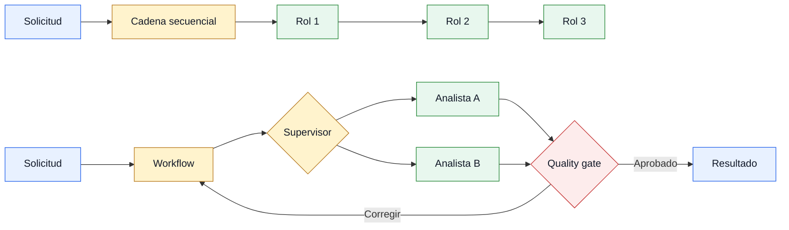
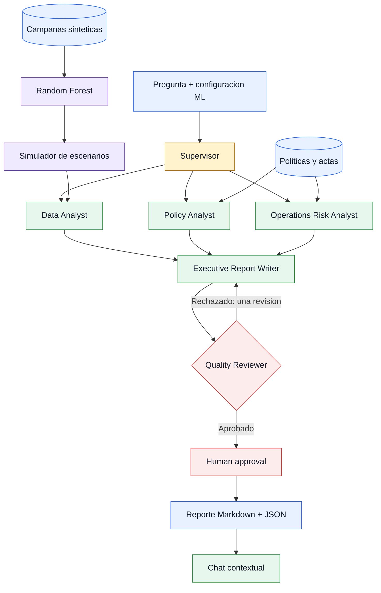
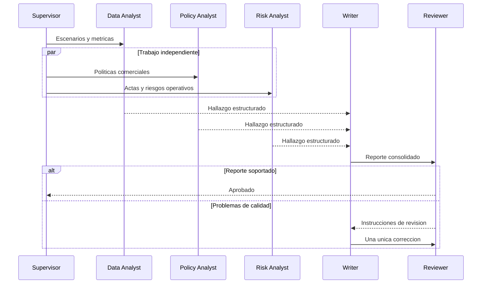
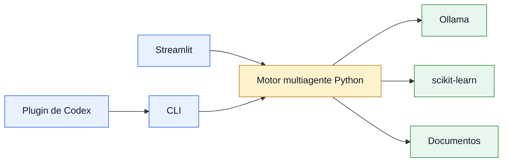

# Sesion 7 - Workflows Inteligentes y Orquestacion

## De un equipo de agentes a un sistema operativo

En la sesion 6 construimos una cadena colaborativa:

```text
Planner -> Researcher -> Writer -> Reviewer -> Final Writer
```

Esa arquitectura permite entender roles y delegacion, pero tiene limites para
un proceso empresarial: siempre ejecuta los mismos pasos, no aprovecha tareas
independientes, no conserva un estado formal y mezcla generacion con control.

En esta sesion construiremos un workflow supervisado que combina:

- Un modelo Random Forest configurable.
- Herramientas deterministas para calcular ingresos y margen.
- Tres agentes especialistas ejecutados en paralelo.
- Un supervisor que define y controla el plan.
- Un Reviewer que aplica un quality gate.
- Aprobacion humana para la decision final.
- Streamlit, CLI, Docker y un plugin instalable en Codex.

El caso guia continua con NovaRetail: seleccionar un descuento para un segmento
y ciudad sin destruir rentabilidad ni ignorar restricciones operativas.

## Objetivos de aprendizaje

Al finalizar la sesion, el estudiante podra:

1. Diferenciar una cadena de agentes de un workflow con estado.
2. Implementar supervision, fan-out, fan-in y rutas condicionales.
3. Separar prediccion, calculos de negocio e interpretacion del LLM.
4. Validar contratos entre agentes con Pydantic.
5. Observar tiempos, errores, fuentes y decisiones del workflow.
6. Empaquetar un sistema multiagente como plugin de Codex.
7. Ejecutar una app local dentro de Docker conectada con Ollama.

## Agenda de tres horas

| Minutos | Bloque | Resultado |
|---:|---|---|
| 0-10 | Activacion | Comparar cadena y workflow |
| 10-25 | Automatizacion | Identificar tareas deterministas y agenticas |
| 25-45 | Orquestacion | Disenar supervisor, paralelismo y quality gate |
| 45-65 | Integracion analitica | Entrenar y evaluar el Random Forest |
| 65-75 | Descanso | Pausa |
| 75-105 | Laboratorio NovaRetail | Ejecutar Streamlit y analizar trazas |
| 105-125 | Plugin de Codex | Entender scaffold, skill y wrapper |
| 125-170 | Reto por equipos | Construir un plugin multiagente distinto |
| 170-180 | Demostraciones | Validar escenarios normal y critico |

## Que es un workflow inteligente

Un workflow es un grafo controlado de tareas. Algunas tareas pueden usar LLM,
pero otras deben ser codigo convencional. La inteligencia no consiste en usar
un modelo en cada nodo, sino en seleccionar correctamente que componente toma
cada decision.

| Tipo de tarea | Implementacion recomendada |
|---|---|
| Calcular margen | Funcion determinista |
| Entrenar un Random Forest | scikit-learn |
| Validar un contrato | Pydantic |
| Interpretar escenarios | Agente LLM |
| Consultar una politica | Recuperacion documental + agente |
| Decidir la siguiente ruta | Supervisor con opciones limitadas |
| Autorizar una accion sensible | Persona responsable |

### Cadena frente a workflow

Una cadena conoce el siguiente paso de antemano. Un workflow incorpora estado,
ramas, condiciones, reintentos y puntos de control.



## Arquitectura de NovaRetail



El supervisor no permite agentes arbitrarios. Solo puede delegar a los tres
especialistas registrados. Este limite reduce rutas inesperadas y hace posible
probar el sistema.

## Fan-out y fan-in

Despues del plan, los tres especialistas reciben los insumos que necesitan y
se ejecutan en paralelo con `ThreadPoolExecutor(max_workers=3)`.



El paralelismo es adecuado porque los especialistas no dependen entre si. El
Writer espera al fan-in: la reunion de todos los resultados disponibles.

## Estado y contratos

Los agentes no se comunican mediante variables sin estructura. El paquete
`agents/intelligent_workflow/contracts.py` define los contratos compartidos:

- `WorkflowRequest`: solicitud, ciudad, segmento y configuracion ML.
- `RandomForestConfig`: hiperparametros con rangos seguros.
- `ScenarioPrediction`: cifras calculadas por herramientas.
- `AgentFinding`: resumen, fuentes, riesgos, estado y tiempo.
- `ReviewDecision`: aprobacion, problemas e instrucciones.
- `WorkflowResult`: artefacto completo y persistible.

Una salida del LLM se solicita con el JSON Schema del modelo Pydantic. Si no
valida, el agente recibe el error y cuenta con un unico reintento. El workflow
no entra en un ciclo indefinido.

## Integracion analitica

### Dataset sintetico

`data/session7_discount_campaigns.csv` contiene 1.200 campanas sinteticas y una
semilla fija. Sus variables incluyen:

- Ciudad, segmento, canal y categoria.
- Descuento aplicado.
- Pedidos base, ticket y costo unitario.
- Capacidad logistica, estacionalidad y devoluciones.
- Incremento porcentual observado en pedidos.

El dataset permite practicar, pero no representa evidencia real ni permite
afirmar causalidad.

### Modelo

El pipeline usa `OneHotEncoder`, `ColumnTransformer` y
`RandomForestRegressor`. El objetivo es `incremental_orders_pct`.

Streamlit expone dos niveles de configuracion:

**Basicos**

- Numero de arboles: 50 a 500.
- Profundidad maxima.
- Minimo de observaciones por hoja.

**Avanzados**

- Minimo de observaciones para dividir.
- Numero de variables consideradas por division.
- Bootstrap.
- Semilla.
- Tamano del conjunto de prueba.

El usuario debe pulsar **Entrenar y ejecutar**. Cambiar un slider no dispara
automaticamente el workflow. Streamlit conserva en cache modelos entrenados con
la misma configuracion y version del CSV.

### Tres responsabilidades diferentes

1. El Random Forest predice el incremento esperado de pedidos.
2. El simulador calcula ingresos, costos, devoluciones y margen.
3. Los agentes interpretan los resultados y aplican contexto documental.

El LLM no suma, multiplica ni modifica las cifras calculadas.

## Observabilidad y fallos

Cada ejecucion conserva una traza con etapa, estado, detalle, instante y tiempo.
Los estados de un especialista son:

- `completed`: salida valida.
- `degraded`: se uso un fallback porque el LLM no entrego JSON valido.
- `failed`: la rama no puede continuar.

El Reviewer verifica como minimo dos fuentes y la seccion `Fuentes`. Solo existe
una correccion automatica. Si sigue rechazado, el resultado queda para revision
humana.

## Laboratorio guiado

### Preparacion

```powershell
ollama pull qwen2.5:3b
python -m pip install -U scikit-learn streamlit ollama pydantic pandas
```

### Ejecutar Streamlit

```powershell
streamlit run apps/sesion7_intelligent_workflow.py
```

1. Seleccione Pereira y Alto valor.
2. Ejecute primero la configuracion base.
3. Compare 50 y 500 arboles.
4. Limite la profundidad y observe MAE, R2 y brecha de sobreajuste.
5. Inspeccione escenarios, agentes y trazas.
6. Revise el quality gate y apruebe la recomendacion.
7. Pregunte: `Por que no conviene el descuento mas alto?`

El chat recibe exclusivamente el `WorkflowResult` actual. Una ejecucion nueva
crea otro historial y evita mezclar escenarios.

### Ejecutar la CLI

```powershell
python apps/sesion7_workflow_cli.py run `
  --question "Que descuento protege mejor el margen?" `
  --city Pereira `
  --segment "Alto valor"
```

La salida termina con `RUN_FILE=<ruta>`. Para consultar esa ejecucion:

```powershell
python apps/sesion7_workflow_cli.py ask `
  --run artifacts/session7/<run-id>.json `
  --question "Que riesgos siguen abiertos?"
```

## Por que Streamlit no llama al plugin

Streamlit, la CLI y Codex son adaptadores del mismo motor:



Hacer que Streamlit ejecute Codex como subproceso agregaria permisos, sesiones y
fallos ajenos al negocio. El plugin delega en la CLI; Streamlit importa el motor
directamente.

## Construccion del plugin de Codex

El plugin de referencia se encuentra en:

```text
plugins/novaretail-intelligence/
├── .codex-plugin/plugin.json
├── skills/novaretail-workflow/SKILL.md
└── scripts/run_workflow.py
```

### 1. Scaffold

El generador oficial normaliza el nombre, crea el manifest y agrega la entrada
al marketplace:

```powershell
python <plugin-creator>/scripts/create_basic_plugin.py novaretail-intelligence `
  --path plugins `
  --marketplace-path .agents/plugins/marketplace.json `
  --with-skills --with-scripts --with-marketplace
```

### 2. Manifest

`.codex-plugin/plugin.json` declara identidad, version, descripcion, skill e
informacion visible en Codex. El nombre debe coincidir con la carpeta.

### 3. Skill

La skill describe cuando activarse, que comando ejecutar, como leer el artefacto
y que limites respetar. Una skill no reemplaza al motor multiagente: lo activa.

### 4. Wrapper

`scripts/run_workflow.py` localiza `pyproject.toml` y delega argumentos a
`apps/sesion7_workflow_cli.py`. No contiene una segunda copia de prompts o reglas.

### 5. Validar e instalar

```powershell
python <plugin-creator>/scripts/validate_plugin.py `
  plugins/novaretail-intelligence

codex plugin marketplace add .
codex plugin add novaretail-intelligence@personal
```

Despues de instalar o actualizar un plugin, abra un hilo nuevo para que Codex
cargue sus skills.

## Docker local

El contenedor incluye Streamlit y el workflow, pero usa el Ollama anfitrion:

```powershell
docker compose -f compose.session7.yml up --build
```

Abra `http://localhost:8501`. La variable
`OLLAMA_HOST=http://host.docker.internal:11434` conecta el contenedor con Ollama.
En Linux, Compose agrega `host.docker.internal:host-gateway`.

Este despliegue es local. Un despliegue publico requeriria alojar tambien la
inferencia o cambiar el proveedor del modelo.

## Reto evaluado por equipos

Los recursos se encuentran en `challenges/session7/`. Cada equipo recibe un CSV,
un clasificador base y una politica. Debe construir e instalar su propio plugin.

### Equipo 1 - Fraude

Plugin sugerido: `fraud-investigation-workflow`.

Roles minimos:

1. Supervisor de fraude.
2. Analista transaccional.
3. Analista de politicas.
4. Investigador de senales.
5. Reviewer.

Debe diferenciar permitir, verificar y escalar. Bloquear una transaccion requiere
aprobacion humana.

### Equipo 2 - Abandono

Plugin sugerido: `customer-retention-workflow`.

Roles minimos:

1. Supervisor de retencion.
2. Analista de comportamiento.
3. Analista de valor.
4. Especialista en ofertas.
5. Reviewer.

Debe combinar riesgo, valor y costo. Una oferta costosa requiere aprobacion.

### Criterios de evaluacion

| Criterio | Peso |
|---|---:|
| Arquitectura multiagente real | 25% |
| Supervisor, paralelismo y delegacion | 20% |
| Integracion analitica | 15% |
| Quality gate, trazas y aprobacion | 15% |
| Plugin, skill e instalacion | 15% |
| Docker, pruebas y demostracion | 10% |

Una sola llamada que simule todos los roles no se considera multiagente. Para
aprobar arquitectura, los roles deben ejecutarse por separado y entregar
artefactos estructurados al supervisor o al consolidado.

## Cierre

Un workflow empresarial robusto no entrega control total al LLM. Combina modelos
predictivos, codigo determinista, agentes especializados, contratos, limites de
iteracion, trazabilidad y autoridad humana. El plugin es una forma de distribuir
esa capacidad; el verdadero producto sigue siendo el motor probado y reutilizable.
