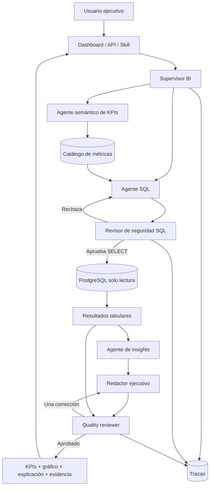
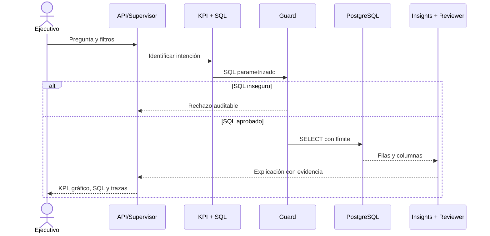
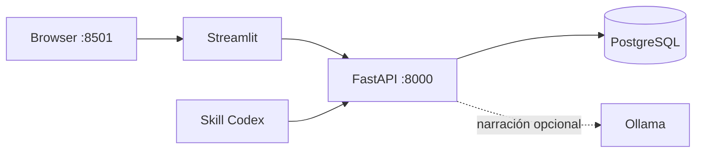
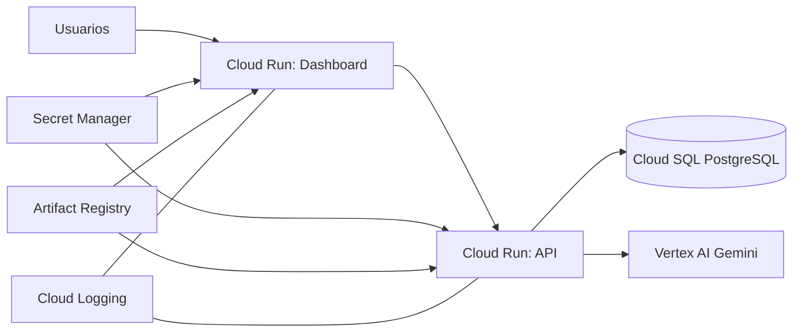

# Sesión 8: agentes analíticos para inteligencia de negocios

## Propósito

En esta sesión construiremos un producto de analítica aumentada para una empresa B2B. Un ejecutivo formula una pregunta; el sistema selecciona un KPI, produce SQL de solo lectura, calcula las cifras en PostgreSQL y entrega una explicación verificable. El objetivo no es estudiar cada línea de Python, sino entender responsabilidades, controles y operación en producción.

Preguntas de demostración:

- ¿Cómo evolucionaron los ingresos por región?
- ¿Dónde se deterioró el margen?
- ¿Qué regiones incumplen la meta?
- ¿Cuál es la conversión del pipeline?
- ¿Qué clientes concentran la cartera vencida?

Los datos son sintéticos y los resultados descriptivos no demuestran causalidad.

## Estructura del multiagente



El **supervisor** decide la ruta; el **agente semántico** conecta el lenguaje del usuario con una definición de KPI; el **agente SQL** usa plantillas parametrizadas; el **revisor SQL** bloquea escritura y tablas ajenas; PostgreSQL calcula; el **agente de insights** compara; el **redactor** comunica; y el **reviewer** exige soporte tabular. Una sola llamada que finja todos los roles no cumple esta arquitectura.



## Datos, contratos y seguridad

`data/session8/init.sql` crea regiones, clientes, vendedores, ventas, oportunidades, metas y pagos para 24 meses. El rol `bi_reader` solo recibe `SELECT`. El catálogo define fórmula, unidad y dimensiones permitidas para ingresos, margen, ticket, conversión, cumplimiento y cartera.

Las fronteras usan Pydantic: solicitud, filtros, KPI, traza y resultado. El guard acepta únicamente `SELECT` o CTE, una sentencia, tablas autorizadas y un límite máximo. Los filtros viajan como parámetros; nunca se concatenan valores del usuario. La API oculta excepciones internas y conserva el SQL aprobado, parámetros, evidencia y estado del reviewer en `artifacts/session8/`.

FastAPI es el producto central. Streamlit y la skill son clientes del mismo contrato:

| Interfaz | Responsabilidad |
|---|---|
| `GET /health` | Verificar API y base de datos |
| `GET /v1/metadata/kpis` | Publicar el catálogo semántico |
| `POST /v1/query` | Ejecutar el workflow completo |
| `POST /v1/explain` | Explicar métricas ya calculadas |
| `GET /v1/runs/{id}` | Recuperar auditoría |

Los endpoints `/v1` requieren `X-API-Key`. Para datos reales debe evolucionarse a IAM/OAuth y políticas por usuario.

## Probar la API desde OpenAPI

1. Inicie primero la API y después el dashboard:

```powershell
python -m poetry run uvicorn apps.sesion8_bi_api:app --reload --port 8000
python -m poetry run streamlit run apps/sesion8_bi_dashboard.py
```

2. Abra `http://localhost:8000/docs`, despliegue `POST /v1/query` y pulse **Try it out**.
3. Escriba `session8-local-key` en `x-api-key`.
4. Envíe este cuerpo:

```json
{
  "question": "¿Cómo evolucionaron los ingresos por región?",
  "start_date": "2026-01-01",
  "end_date": "2026-12-31",
  "filters": {"region": "Andina"},
  "max_rows": 200
}
```

5. Pulse **Execute**. Un resultado correcto responde `200` y contiene:

- `sql`: consulta aprobada por el guard.
- `rows`: evidencia calculada por la base de datos.
- `kpis`: indicadores consolidados.
- `executive_summary`: interpretación ejecutiva.
- `review_approved`: decisión del quality reviewer.
- `traces`: participación y duración de cada agente.

Pruebe después: `¿Cuál es la conversión comercial?`, `¿Cómo se comportó el margen por región?`, `¿Qué regiones incumplieron la meta?` y `¿Qué clientes concentran la cartera vencida?`. Los endpoints `/v1` requieren la API key; `/health`, `/docs` y `/openapi.json` no la requieren.

La misma consulta desde PowerShell:

```powershell
$headers = @{"X-API-Key"="session8-local-key"}
$body = @{
  question = "¿Cómo evolucionaron los ingresos por región?"
  start_date = "2026-01-01"
  end_date = "2026-12-31"
  filters = @{region="Andina"}
  max_rows = 200
} | ConvertTo-Json -Depth 4

Invoke-RestMethod http://localhost:8000/v1/query `
  -Method Post -Headers $headers -ContentType "application/json" -Body $body
```

Si aparece `ERR_CONNECTION_REFUSED`, la API no está ejecutándose. Si Swagger no carga, compruebe primero que `http://localhost:8000/openapi.json` responde y que su campo `openapi` es `3.0.3`.

## Docker local



Copie la configuración y levante el perfil completo:

```powershell
Copy-Item .env.session8.example .env
docker compose --env-file .env -f compose.session8.yml --profile ollama up --build
```

El volumen `session8-ollama` conserva el modelo. Este no se incorpora a la imagen: así la API y el dashboard siguen siendo pequeños. Sin Ollama:

```powershell
docker compose --env-file .env -f compose.session8.yml up --build
```

Abra `http://localhost:8501`; la documentación OpenAPI queda en `http://localhost:8000/docs`. Para reiniciar completamente los datos del laboratorio puede eliminar los volúmenes explícitamente; esto borra la base local.

## Skill de Codex

`plugins/b2b-bi-intelligence/` contiene manifest, skill, referencia del contrato y cliente HTTP. La skill no implementa agentes ni ejecuta SQL: invoca la API y respeta su quality gate.

```powershell
$env:BI_API_URL="http://localhost:8000"
$env:API_KEY="session8-local-key"
python plugins/b2b-bi-intelligence/skills/b2b-bi-intelligence/scripts/query_bi.py query `
  --question "¿Cómo evolucionaron los ingresos?" --region Andina
```

## Papel del modelo de lenguaje

El sistema no depende del LLM para obtener resultados correctos. PostgreSQL calcula las cifras, el catálogo determina el KPI y el guard valida el SQL. El modelo solo intenta mejorar la redacción del resumen ejecutivo.

En local, `ENABLE_LLM=false` mantiene el flujo completamente determinista. Para probar Ollama:

```powershell
$env:ENABLE_LLM="true"
$env:LLM_PROVIDER="ollama"
$env:OLLAMA_HOST="http://localhost:11434"
$env:OLLAMA_MODEL="qwen2.5:3b"
```

En Google Cloud la API está configurada con `ENABLE_LLM=true`, `LLM_PROVIDER=vertex` y Gemini en Vertex AI. Revise la traza `executive_writer`:

- `completed`: el modelo respondió o se conservó correctamente la narrativa determinista.
- `degraded`: Vertex AI no respondió y se usó el resumen determinista.

Por diseño, una caída del modelo no impide consultar SQL, calcular KPIs ni usar el dashboard. Para una práctica posterior se puede ampliar la contribución del LLM, conservando el cálculo y la validación fuera del modelo.

## Producción en Google Cloud



Este ejercicio se despliega en **Google Cloud Platform**. El piloto usa Cloud Run para API y dashboard, Cloud SQL para PostgreSQL, Artifact Registry para las imágenes, Cloud Build para construirlas, Secret Manager para credenciales y Vertex AI para el LLM.

### 1. Crear la cuenta y el proyecto

1. Ingrese a [Google Cloud Console](https://console.cloud.google.com/) con la cuenta autorizada.
2. Abra el selector superior de proyectos y pulse **Nuevo proyecto**.
3. Asigne un nombre y un `Project ID` globalmente único. El ID no se puede cambiar después.
4. Si pertenece a una organización empresarial, seleccione la organización y carpeta autorizadas. Si no puede crear proyectos, solicite `roles/resourcemanager.projectCreator`.

El proyecto de referencia del curso es:

```text
Nombre: Curso Multiagentes
Project ID: curso-multiagentes-01
Región del piloto: us-central1
```

Cada estudiante debe usar su propio `Project ID`; no debe intentar desplegar sobre el proyecto de referencia.

### 2. Crear y asociar la facturación

Google Workspace y Google Cloud usan facturaciones diferentes. En **Facturación**:

1. Cree o seleccione una cuenta de Cloud Billing autorizada por la organización.
2. Abra **Administración de la cuenta → Mis proyectos**.
3. Vincule el proyecto con esa cuenta.
4. Compruebe que el estado de facturación del proyecto sea activo.
5. Cree un presupuesto y alertas al 50 %, 80 % y 100 %.

Verifique desde la CLI:

```powershell
gcloud.cmd billing projects describe <PROJECT_ID> `
  --format="yaml(projectId,billingEnabled)"
```

Debe mostrar `billingEnabled: true`. Un presupuesto genera alertas, pero **no detiene automáticamente el gasto**. Cloud SQL es el principal costo continuo del ejercicio; elimine la instancia al terminar si la demostración no debe permanecer disponible.

### 3. Instalar y autenticar Google Cloud CLI

Instale [Google Cloud CLI](https://cloud.google.com/sdk/docs/install). En Windows use `gcloud.cmd`, pues algunas políticas bloquean `gcloud.ps1`:

```powershell
gcloud.cmd auth login
gcloud.cmd auth application-default login
gcloud.cmd config set project <PROJECT_ID>
gcloud.cmd config set run/region us-central1
gcloud.cmd config set compute/region us-central1
gcloud.cmd auth list
gcloud.cmd config list
```

No comparta contraseñas, tokens, códigos MFA, claves JSON ni IDs de facturación.

### 4. Habilitar servicios

```powershell
gcloud.cmd services enable `
  run.googleapis.com `
  artifactregistry.googleapis.com `
  cloudbuild.googleapis.com `
  sqladmin.googleapis.com `
  secretmanager.googleapis.com `
  aiplatform.googleapis.com `
  iam.googleapis.com
```

Habilitar una API no crea por sí mismo una carga de cómputo. Cloud SQL y las construcciones comienzan a generar costo cuando se crean o ejecutan.

### 5. Definir variables y crear Artifact Registry

```powershell
$ProjectId = "<PROJECT_ID>"
$Region = "us-central1"
$Repository = "multiagent-course"
$Instance = "session8-postgres"

gcloud.cmd artifacts repositories create $Repository `
  --project=$ProjectId --location=$Region `
  --repository-format=docker `
  --description="Imágenes del curso multiagentes"
```

### 6. Crear identidades de servicio

Separar identidades evita que el dashboard herede permisos de base de datos o Vertex AI:

```powershell
gcloud.cmd iam service-accounts create session8-api `
  --project=$ProjectId --display-name="session8-api"
gcloud.cmd iam service-accounts create session8-dashboard `
  --project=$ProjectId --display-name="session8-dashboard"

$ApiServiceAccount = "session8-api@$ProjectId.iam.gserviceaccount.com"
$DashboardServiceAccount = "session8-dashboard@$ProjectId.iam.gserviceaccount.com"

gcloud.cmd projects add-iam-policy-binding $ProjectId `
  --member="serviceAccount:$ApiServiceAccount" --role="roles/cloudsql.client"
gcloud.cmd projects add-iam-policy-binding $ProjectId `
  --member="serviceAccount:$ApiServiceAccount" --role="roles/aiplatform.user"
```

### 7. Crear Cloud SQL

Para el laboratorio se usa una instancia compartida sin SLA, apropiada para desarrollo y no para una carga empresarial real:

```powershell
gcloud.cmd sql instances create $Instance `
  --project=$ProjectId --region=$Region `
  --database-version=POSTGRES_17 --edition=ENTERPRISE `
  --tier=db-f1-micro --storage-type=SSD --storage-size=10 `
  --storage-auto-increase --availability-type=zonal `
  --no-deletion-protection

gcloud.cmd sql databases create session8 `
  --project=$ProjectId --instance=$Instance
gcloud.cmd sql users create bi_reader `
  --project=$ProjectId --instance=$Instance --prompt-for-password
```

Cargue `data/session8/init.sql` con una cuenta administradora. Cree `bi_reader` antes de importar para que el bloque local no reemplace su contraseña. El usuario de la aplicación solo debe recibir `CONNECT`, `USAGE` y `SELECT`.

### 8. Crear secretos sin saltos de línea

Genere una contraseña de base de datos y una API key diferentes. Nunca use `session8-local-key` en producción. La URL administrada utiliza el socket de Cloud SQL:

```text
postgresql+psycopg://bi_reader:<PASSWORD>@/session8?host=/cloudsql/<PROJECT_ID>:<REGION>:<INSTANCE>
```

Al cargar secretos desde PowerShell use un archivo temporal UTF-8 **sin `CRLF`**. Un salto de línea en `API_KEY` produce `Illegal header value`; un espacio en `DATABASE_URL` hace que Psycopg busque un socket inexistente.

```powershell
$temp = [IO.Path]::GetTempFileName()
try {
  [IO.File]::WriteAllText($temp, $SecretValue, [Text.UTF8Encoding]::new($false))
  gcloud.cmd secrets versions add <SECRET_NAME> `
    --project=$ProjectId --data-file=$temp
} finally {
  Remove-Item -LiteralPath $temp -Force
}
```

Cree `SESSION8_DATABASE_URL` y `SESSION8_API_KEY`. Conceda `roles/secretmanager.secretAccessor` solo a la API para ambos secretos y al dashboard únicamente para `SESSION8_API_KEY`.

### 9. Construir las imágenes

`cloudbuild.session8.yaml` construye los dos Dockerfiles y publica las imágenes en Artifact Registry:

```powershell
gcloud.cmd builds submit `
  --project=$ProjectId --region=$Region `
  --config=cloudbuild.session8.yaml `
  --substitutions="_REGION=$Region,_REPOSITORY=$Repository,_TAG=v1" .
```

Use versiones como `v1`, `v2` o un hash de Git; no dependa únicamente de `latest`.

### 10. Desplegar API y dashboard

El script automatiza las revisiones una vez existen Cloud SQL, cuentas de servicio y secretos:

```powershell
$ConnectionName = gcloud.cmd sql instances describe $Instance `
  --project=$ProjectId --format="value(connectionName)"

powershell -ExecutionPolicy Bypass -File deploy/session8-cloud-run.ps1 `
  -ProjectId $ProjectId -Region $Region -Repository $Repository `
  -CloudSqlInstance $ConnectionName
```

El piloto permite acceso público a Cloud Run. La API sigue requiriendo `X-API-Key`, que el dashboard obtiene desde Secret Manager. Ambos servicios usan mínimo cero y máximo dos instancias. Para datos reales, sustituya este esquema por IAM/IAP y autenticación servicio a servicio.

### 11. Verificar el despliegue

```powershell
$ApiUrl = gcloud.cmd run services describe session8-bi-api `
  --project=$ProjectId --region=$Region --format="value(status.url)"
$DashboardUrl = gcloud.cmd run services describe session8-bi-dashboard `
  --project=$ProjectId --region=$Region --format="value(status.url)"

Invoke-RestMethod "$ApiUrl/health"
Start-Process "$ApiUrl/docs"
Start-Process $DashboardUrl
gcloud.cmd run services logs read session8-bi-api `
  --project=$ProjectId --region=$Region --limit=50
```

La API key productiva puede copiarse sin imprimirla:

```powershell
$key = (& gcloud.cmd secrets versions access latest `
  --secret=SESSION8_API_KEY --project=$ProjectId 2>$null | Out-String).Trim()
Set-Clipboard -Value $key
```

### 12. URLs del piloto del curso

- Dashboard Streamlit: <https://session8-bi-dashboard-fp4t5mvsrq-uc.a.run.app>
- API OpenAPI/Swagger: <https://session8-bi-api-fp4t5mvsrq-uc.a.run.app/docs>
- Health check: <https://session8-bi-api-fp4t5mvsrq-uc.a.run.app/health>

Estas URLs corresponden al proyecto de demostración y pueden cambiar o dejar de estar disponibles al finalizar el curso. No comparta la API key productiva.

### 13. Operación y cierre de costos

- Revise Cloud Logging después de cada revisión.
- Configure alertas de presupuesto; recuerde que no son un tope automático.
- Mantenga Cloud Run en mínimo cero para el piloto.
- Use tags inmutables y despliegue gradual antes de producción real.
- Destruya versiones de secretos incorrectas o antiguas después de validar la nueva revisión.
- Elimine Cloud SQL, imágenes y buckets cuando termine el laboratorio si no necesita conservar la demo.
- No promueva datos sintéticos, API key compartida ni `db-f1-micro` como arquitectura empresarial final.

## Cómo probar el sistema

### Automatización

```powershell
poetry install
poetry run pytest tests/test_session8_business_intelligence.py -q
docker compose -f compose.session8.yml config
```

Las pruebas cubren cálculo esperado, filtros, trazas, recuperación de ejecuciones, autenticación y rechazo de SQL peligroso. El LLM no forma parte de la prueba numérica.

### Smoke test local

```powershell
Invoke-RestMethod http://localhost:8000/health
$headers = @{"X-API-Key"="session8-local-key"}
$body = @{question="¿Cómo evolucionaron los ingresos por región?"; filters=@{region="Andina"}} | ConvertTo-Json
Invoke-RestMethod http://localhost:8000/v1/query -Method Post -Headers $headers -ContentType application/json -Body $body
```

Compruebe que el resultado contiene filas, SQL con `LIMIT`, evidencias, trazas de agentes y `review_approved=true`. Después pruebe API key incorrecta, un filtro sin resultados y preguntas de cada KPI.

### Verificación productiva

- `/health` responde y Cloud SQL acepta la conexión de solo lectura.
- Dashboard → API → Cloud SQL completa una consulta.
- La cuenta de servicio puede usar Vertex AI sin claves descargadas.
- Los secretos no aparecen en logs ni respuestas.
- Timeout, base caída y proveedor LLM caído producen fallos controlados.
- Una revisión nueva recibe tráfico y puede revertirse.

## Laboratorio y cierre

Ejecute cinco preguntas, compare el SQL, identifique qué agente evita una modificación y explique por qué la cifra proviene de PostgreSQL. Como reto, agregue un KPI al catálogo, una consulta segura, una tarjeta del dashboard y sus pruebas. La conclusión clave es que la analítica aumentada no delega la verdad numérica al LLM: combina semántica, cálculo determinista, especialización, control y evidencia.
