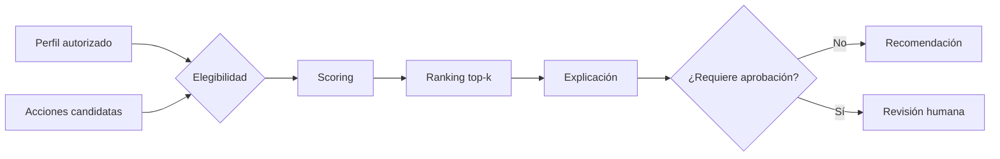

# Sesión 9: agentes especializados por dominio

## Propósito

En las sesiones anteriores construimos agentes con herramientas, RAG, workflows
y analítica de negocios. Esta sesión no agrega otro equipo de agentes. Su
objetivo es aprender a decidir qué arquitectura necesita cada problema y a
formular el proyecto final con un alcance defendible.

El laboratorio introduce un sistema de recomendación determinista y auditable:
para cada cliente sintético prioriza la siguiente mejor acción comercial sin
inventar atributos ni saltarse reglas de elegibilidad.

## Objetivos de aprendizaje

Al finalizar la sesión, el estudiante podrá:

1. Diferenciar responsabilidades financieras, comerciales y operativas.
2. Seleccionar entre código, modelo predictivo, agente o sistema multiagente.
3. Explicar los elementos de un sistema de recomendación.
4. Separar elegibilidad, puntuación, ranking y aprobación humana.
5. Diseñar conceptualmente el sistema multiagente del proyecto final.

## Agenda de tres horas

| Minutos | Bloque | Resultado |
|---:|---|---|
| 0-15 | Activación | Comparar sistemas de sesiones anteriores |
| 15-45 | Dominios | Identificar datos, herramientas y controles |
| 45-70 | Recomendación | Entender elegibilidad, scoring y ranking |
| 70-80 | Descanso | Pausa |
| 80-120 | Laboratorio | Ejecutar siguiente mejor acción |
| 120-160 | Proyecto final | Completar canvas y arquitectura |
| 160-175 | Revisión cruzada | Detectar sobrearquitectura y riesgos |
| 175-180 | Cierre | Entregar el hito 1 |

## Especialización por dominio

### Agentes financieros

Trabajan con precios, estados financieros, presupuestos, cartera o riesgo. Los
cálculos deben permanecer en funciones o motores deterministas. Un LLM puede
interpretar y redactar, pero no sustituye la fórmula ni la fuente.

Controles mínimos:

- Fecha, moneda y fuente visibles.
- Advertencia sobre datos retrasados o incompletos.
- Separación entre descripción y recomendación.
- Aprobación humana para operaciones o decisiones sensibles.

El agente de investigación financiera de la sesión 3 es el referente.

### Agentes de marketing

Interpretan campañas, segmentos, canales, conversión y experimentos. El mayor
riesgo es confundir correlación con causalidad o personalizar usando atributos
sin autorización.

Controles mínimos:

- Definición explícita de conversión y ventana temporal.
- Identificación de cohortes y sesgo de selección.
- Diferenciación entre prueba A/B y análisis observacional.
- Límites de presión comercial y frecuencia de contacto.

El workflow de descuentos de la sesión 7 ofrece un caso aplicable.

### Agentes de soporte operativo

Clasifican solicitudes, consultan políticas, preparan respuestas o activan
procesos. La prioridad es limitar autoridad y mantener trazabilidad.

Controles mínimos:

- Herramientas permitidas por rol.
- Acciones reversibles por defecto.
- Escalamiento de excepciones.
- Confirmación humana para efectos materiales.
- Idempotencia para evitar acciones duplicadas.

### Sistemas de recomendación

Un recomendador no necesita ser un agente. Puede ser una secuencia controlada:



La elegibilidad aplica políticas duras. El scoring combina señales graduadas.
El ranking ordena. La explicación muestra factores existentes; no crea una
historia psicológica sobre el cliente.

## Arquitectura del laboratorio

El paquete `agents/domain_recommender/` define:

- `CustomerProfile`: segmento, canal, afinidad y consentimiento.
- `CandidateAction`: acción, costo, conversión esperada y riesgo.
- `RecommendationRequest`: perfil, candidatos, `top_k` y límite de riesgo.
- `Recommendation`: posición, puntuación, factores y aprobación.
- `RecommendationResult`: recomendaciones y exclusiones explicadas.

El motor usa cuatro factores:

| Factor | Peso | Pregunta |
|---|---:|---|
| Afinidad de categoría | 30 % | ¿La categoría coincide con intereses declarados? |
| Canal | 20 % | ¿Es el canal preferido? |
| Valor esperado | 35 % | ¿Conversión esperada menos incentivo crea valor? |
| Seguridad operativa | 15 % | ¿La acción mantiene riesgo bajo? |

Los pesos son parte de la política didáctica, no una verdad universal.

## Laboratorio

Ejecute el notebook:

```powershell
python -m poetry run jupyter notebook notebooks/07_domain_specialization_recommendation.ipynb
```

Preguntas de análisis:

1. ¿Por qué una acción fue excluida y no solo relegada?
2. ¿Qué cambia si se aumenta el costo del incentivo?
3. ¿Qué ocurre con un cliente sin autorización de contacto?
4. ¿Qué acciones requieren aprobación para una persona vulnerable?
5. ¿Qué sesgo produciría optimizar únicamente el valor esperado?

## ¿Qué arquitectura necesita el proyecto?

| Necesidad | Componente recomendado |
|---|---|
| Cálculo estable | Función determinista |
| Predicción sobre datos históricos | Modelo estadístico o ML |
| Interpretación de lenguaje | Agente LLM |
| Consulta de documentos | RAG |
| Varias tareas independientes | Workflow con fan-out/fan-in |
| Decisión sensible | Aprobación humana |
| Priorización personalizable | Elegibilidad + scoring + ranking |

Un sistema multiagente se justifica cuando existen responsabilidades separables,
contratos claros y coordinación observable. Agregar nombres de roles dentro de
un único prompt no crea agentes independientes.

## Hito 1 del proyecto final

Cada equipo entrega la plantilla disponible en
`challenges/session9/project_canvas.md`. El hito equivale al 10 % de la nota
total:

| Criterio | Peso |
|---|---:|
| Diseño conceptual y arquitectura | 4 % |
| Especialización y coordinación | 2 % |
| Datos, herramientas y recomendación | 2 % |
| Alcance, riesgos y demostración | 2 % |

La arquitectura debe incluir entradas, agentes, herramientas, estado,
quality gate, aprobación humana, trazas y artefacto final.

## Cierre

La especialización no consiste en cambiar el título del prompt. Un agente de
dominio necesita fuentes, herramientas, contratos, límites y criterios de
evaluación propios. El proyecto final debe usar tantos componentes como el
problema requiere, no tantos como sea posible.

