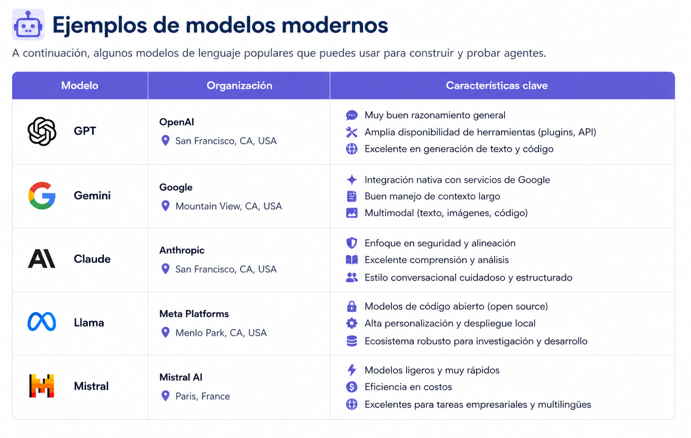

# Sesión 1 — Introducción a los Agentes Inteligentes y la IA Autónoma

## Modelos Multiagentes e Inteligencia Artificial Autónoma
### Maestría en Inteligencia de Negocios

---

# Objetivos de aprendizaje

Al finalizar esta sesión, el estudiante estará en capacidad de:

1. Comprender qué es un agente inteligente y cómo se diferencia de un chatbot tradicional.
2. Identificar aplicaciones empresariales modernas de agentes IA.
3. Reconocer el rol de los modelos de lenguaje (LLMs) en los sistemas multiagente.
4. Diseñar prompts básicos orientados a problemas de negocio.
5. Construir su primer agente conversacional utilizando prompting estructurado.

---

# Motivación

Durante muchos años, los sistemas analíticos tradicionales estuvieron orientados principalmente a:

- construir dashboards,
- automatizar reportes,
- generar modelos predictivos,
- y analizar información histórica.

Sin embargo, la llegada de los modelos de lenguaje de gran escala (LLMs) transformó profundamente la interacción entre las personas y la información.

Hoy en día, las organizaciones están construyendo:

- asistentes inteligentes,
- copilotos empresariales,
- agentes analíticos,
- automatizadores de tareas,
- generadores automáticos de reportes,
- sistemas autónomos de soporte,
- y ecosistemas completos de agentes especializados.

La idea central detrás de este curso es entender cómo construir este tipo de soluciones modernas.

---

# ¿Qué es un agente inteligente?

Un agente inteligente es un sistema capaz de:

1. Percibir información del entorno.
2. Interpretar esa información.
3. Tomar decisiones.
4. Ejecutar acciones.
5. Adaptarse según el contexto.

---

# Analogía sencilla

Pensemos en un analista humano.

Un analista:

- recibe información,
- interpreta datos,
- consulta documentos,
- toma decisiones,
- genera recomendaciones,
- y responde preguntas.

Un agente inteligente busca replicar parcialmente este comportamiento utilizando Inteligencia Artificial.

---

# Arquitectura conceptual de un agente

```{mermaid}
flowchart LR

A[Entorno] --> B[Percepción]
B --> C[Razonamiento]
C --> D[Acción]
D --> A
```

---

# Componentes principales de un agente moderno

## Entrada

Información que recibe:

- preguntas,
- documentos,
- imágenes,
- indicadores,
- datos,
- APIs,
- eventos.

---

## Memoria

Capacidad para recordar:

- conversaciones,
- instrucciones,
- documentos,
- contexto empresarial.

---

## Razonamiento

Proceso mediante el cual el agente:

- interpreta,
- analiza,
- organiza,
- decide,
- prioriza.

---

## Acción

Capacidad para:

- responder,
- consultar herramientas,
- ejecutar tareas,
- automatizar procesos,
- generar contenido.

---

# Chatbot vs Agente Inteligente

| Chatbot | Agente Inteligente |
|---|---|
| Responde preguntas | Toma decisiones |
| Conversación simple | Ejecuta acciones |
| Limitado al diálogo | Usa herramientas |
| Poco contexto | Maneja memoria |
| Flujo fijo | Adaptativo |
| Generalmente reactivo | Puede planificar |

---

# ¿Qué son los LLMs?

Los Large Language Models (LLMs) son modelos de Inteligencia Artificial entrenados sobre enormes volúmenes de texto.

Estos modelos son capaces de:

- comprender lenguaje natural,
- generar texto,
- resumir,
- traducir,
- programar,
- analizar documentos,
- responder preguntas,
- razonar parcialmente.

---

# Ejemplos de modelos modernos



---

# ¿Por qué los LLMs cambiaron todo?

Antes:

- los sistemas IA eran especializados,
- rígidos,
- difíciles de adaptar.

Ahora:

- un mismo modelo puede resolver múltiples tareas,
- interactúa en lenguaje natural,
- puede conectarse con herramientas,
- puede consultar documentos,
- y puede coordinar otros agentes.

---

# Casos empresariales modernos

## Copilotos empresariales

Asistentes capaces de:

- resumir reuniones,
- generar reportes,
- responder preguntas,
- interpretar KPIs.

---

## Agentes financieros

Sistemas capaces de:

- interpretar mercados,
- resumir noticias,
- analizar indicadores,
- generar alertas.

---

## Agentes documentales

Asistentes que:

- leen PDFs,
- consultan políticas,
- responden preguntas,
- buscan información específica.

---

## Automatización empresarial

Sistemas capaces de:

- clasificar tickets,
- responder correos,
- priorizar solicitudes,
- automatizar workflows.

---

# Introducción al Prompt Engineering

Un prompt es la instrucción que le damos a un modelo de lenguaje.

La calidad del resultado depende fuertemente de:

- claridad,
- contexto,
- estructura,
- ejemplos,
- restricciones.

---

# Ejemplo básico

## Prompt pobre

```text
Analiza estas ventas.
```

---

## Prompt mejorado

```text
Actúa como un analista de inteligencia de negocios.

Analiza el siguiente comportamiento de ventas:

- Enero: 1200 unidades
- Febrero: 1500 unidades
- Marzo: 900 unidades

Identifica tendencias, posibles riesgos y recomendaciones empresariales.
```

---

# Componentes de un buen prompt

| Elemento | Descripción |
|---|---|
| Rol | Qué papel debe asumir el modelo |
| Contexto | Información relevante |
| Tarea | Qué debe hacer |
| Restricciones | Límites o formato esperado |
| Salida esperada | Cómo debe responder |

---

# Ejemplo empresarial estructurado

```text
Actúa como un consultor senior de Inteligencia de Negocios.

Contexto:
La empresa presenta caída en el Open Rate de campañas de marketing.

Tarea:
Analiza posibles causas y plantea hipótesis.

Restricciones:
- Máximo 5 hipótesis.
- Prioriza impacto de negocio.
- Usa lenguaje ejecutivo.
```

---

# Actividad 1 — Explorando cómo piensan los agentes

## Objetivo

Comprender cómo cambia el comportamiento de un agente IA dependiendo de:

- el contexto entregado,
- la calidad del prompt,
- el rol asignado,
- las restricciones,
- y el modelo utilizado.

La idea central de esta actividad es que los estudiantes descubran que:

> los agentes NO son mágicos.

La calidad de sus respuestas depende enormemente de:

- qué información reciben,
- cómo se estructura la instrucción,
- y qué tan claro es el objetivo.

---

# Caso empresarial

Actualmente usted se encuentra en un proyecto de Machine Learning para la unidad de negocio de Mercado Pago.

Se está desarrollando un experimento A/B entre dos soluciones:

- MLD
- Journey

La métrica principal del experimento es el Activation Rate:

genui{"math_block_widget_always_prefetch_v2":{"content":"Activation\ Rate = rac{Cantidad\ de\ activaciones}{Cantidad\ de\ usuarios}"}}

Resultados observados:

| Experimento | Activation Rate |
|---|---|
| MLD | 23.37% |
| Journey | 25.33% |

El objetivo es entender:

> ¿Por qué Journey parece tener mejores resultados?

---

# Dataset del ejercicio

Usaremos el dataset:

```text
activations_data.csv
```

Variables disponibles:

| Variable | Descripción |
|---|---|
| Id | Identificador del usuario |
| Activo | 1 si activó, 0 si no |
| Segmento | Ecosistémico u Orgánico |
| Flujo | Flujo utilizado para activarse |
| SO | Sistema Operativo |
| Batería | Nivel de batería |
| Experimento | MLD o Journey |

---

# Notebook práctico — Explorando agentes IA

## Paso 1 — Cargar el dataset

```python
import pandas as pd


df = pd.read_csv("activations_data.csv")

print(df.head())
```

---

# Primer experimento — Prompt pobre

## Prompt

```text
Analiza este dataset.
```

---

# Discusión

## Preguntas para los estudiantes

1. ¿Qué problemas tiene este prompt?
2. ¿Qué información le falta al agente?
3. ¿Qué tipo de respuesta esperamos obtener?
4. ¿Cómo podría malinterpretar el problema?

---

# Segundo experimento — Prompt con contexto

## Prompt

```text
Actualmente estamos realizando un experimento A/B en Mercado Pago.

Existen dos soluciones:
- MLD
- Journey

La métrica principal es Activation Rate.

Necesitamos entender por qué Journey presenta mejores resultados.

Analiza el dataset y plantea posibles hipótesis.
```

---

# Discusión

## Comparación con el prompt anterior

Analizar:

- profundidad,
- claridad,
- foco empresarial,
- hipótesis generadas,
- capacidad analítica.

---

# Tercer experimento — Prompt estructurado

## Prompt avanzado

```text
Actúa como un Senior Data Scientist especializado en experimentación y análisis de producto.

Contexto:
Actualmente estamos realizando un experimento A/B en Mercado Pago para comparar dos soluciones de activación:
- MLD
- Journey

La métrica principal es Activation Rate.

Resultados actuales:
- MLD: 23.37%
- Journey: 25.33%

Disponemos de variables como:
- Segmento
- Sistema Operativo
- Flujo
- Nivel de batería

Tarea:
1. Propón hipótesis que expliquen la diferencia.
2. Sugiere análisis estadísticos relevantes.
3. Identifica posibles sesgos experimentales.
4. Sugiere visualizaciones importantes.
5. Prioriza hipótesis según impacto potencial.

Restricciones:
- Responde como consultor ejecutivo.
- No inventes información no observable.
- Diferencia claramente hechos de hipótesis.
```

---

# Comparación entre prompts

| Aspecto | Prompt pobre | Prompt intermedio | Prompt avanzado |
|---|---|---|---|
| Contexto | Bajo | Medio | Alto |
| Precisión | Baja | Media | Alta |
| Capacidad analítica | Limitada | Moderada | Mucho más profunda |
| Riesgo de ambigüedad | Alto | Medio | Bajo |
| Calidad esperada | Baja | Media | Alta |

---

# Elementos clave del Prompt Engineering

## 1. Rol

Define:

> ¿Quién debe ser el agente?

Ejemplo:

```text
Actúa como un analista senior de experimentación.
```

---

## 2. Contexto

Define:

> ¿Qué está ocurriendo?

Mientras más contexto relevante:

- menos ambigüedad,
- mejores hipótesis,
- respuestas más útiles.

---

## 3. Tarea

Define:

> ¿Qué queremos exactamente?

Por ejemplo:

- analizar,
- resumir,
- clasificar,
- generar hipótesis,
- priorizar.

---

## 4. Restricciones

Ayudan a controlar:

- longitud,
- tono,
- precisión,
- formato,
- creatividad.

---

## 5. Formato esperado

Ejemplo:

```text
Entrega la respuesta en formato tabla.
```

O:

```text
Diferencia hechos de hipótesis.
```

---

# Actividad 2 — Comparando modelos IA

## Objetivo

Descubrir que distintos modelos:

- responden diferente,
- razonan diferente,
- tienen distintos niveles de profundidad,
- y distintos sesgos.

---

# Experimento en vivo

Vamos a ejecutar el mismo prompt en distintos modelos:

---

# Preguntas de análisis

1. ¿Cuál modelo genera mejores hipótesis?
2. ¿Cuál parece más estructurado?
3. ¿Cuál parece más creativo?
4. ¿Cuál parece más conservador?
5. ¿Cuál parece más útil para negocio?

---

# Actividad 3 — Diseñando un agente empresarial

## Escenario

Cada grupo deberá diseñar conceptualmente un agente IA especializado para resolver problemas analíticos empresariales.

---

## Ejemplos posibles

- Agente de experimentación A/B.
- Agente financiero.
- Agente de análisis comercial.
- Agente de soporte analítico.
- Agente de monitoreo de KPIs.

---

## Trabajo en grupos

Definir:

1. Nombre del agente.
2. Objetivo empresarial.
3. Usuarios objetivo.
4. Información requerida.
5. Posibles herramientas.
6. Qué tareas automatizaría.
7. Riesgos del sistema.
8. Prompt inicial del agente.

---

# Construyendo el primer agente

```python
from openai import OpenAI

client = OpenAI()

prompt = """
Actúa como un Senior Data Scientist especializado en experimentación.

Estamos evaluando un A/B test entre MLD y Journey.

Journey presenta mejores resultados de Activation Rate.

Propón hipótesis empresariales y técnicas que podrían explicar el comportamiento.
"""

response = client.chat.completions.create(
    model="gpt-4.1-mini",
    messages=[
        {
            "role": "system",
            "content": "You are a business experimentation expert."
        },
        {
            "role": "user",
            "content": prompt
        }
    ]
)

print(response.choices[0].message.content)
```

---

# Ideas clave de esta práctica

## Los agentes NO "piensan" como humanos

Los agentes:

- dependen del contexto,
- interpretan patrones del lenguaje,
- responden según la instrucción recibida.

---

## Un buen prompt cambia radicalmente el resultado

Pequeños cambios pueden afectar:

- profundidad,
- precisión,
- creatividad,
- utilidad empresarial,
- claridad.

---

## Diferentes modelos tienen diferentes comportamientos

No todos los modelos:

- razonan igual,
- responden igual,
- ni tienen las mismas fortalezas.

---

# Discusión crítica

## Preguntas orientadoras

1. ¿Qué riesgos existen al usar agentes IA en empresas?
2. ¿Qué sucede si el agente inventa información?
3. ¿Qué procesos NO deberían automatizarse completamente?
4. ¿Cómo afecta esto el trabajo analítico tradicional?
5. ¿Qué ventajas competitivas podrían surgir?

---

# Limitaciones actuales de los agentes

Los agentes todavía presentan problemas como:

- hallucinations,
- errores de razonamiento,
- respuestas inconsistentes,
- dependencia del contexto,
- sesgos,
- costos computacionales.

---

# Hacia dónde vamos en el curso

Durante el semestre construiremos progresivamente:

1. Agentes simples.
2. Agentes especializados.
3. Agentes con herramientas.
4. Sistemas RAG.
5. Sistemas multiagente.
6. Workflows empresariales inteligentes.

---

# Cierre de la sesión

## Ideas clave

- Un agente inteligente es mucho más que un chatbot.
- Los LLMs permitieron construir sistemas altamente flexibles.
- El prompting es una habilidad fundamental.
- Los agentes modernos pueden automatizar tareas empresariales complejas.
- Los sistemas multiagente representan una nueva forma de construir soluciones IA.

---

# Taller para la próxima sesión

## Entregable

Diseñar conceptualmente un agente empresarial.

Debe incluir:

1. Problema empresarial.
2. Tipo de agente.
3. Usuarios objetivo.
4. Información requerida.
5. Posibles herramientas.
6. Riesgos y limitaciones.
7. Prompt inicial del agente.

---

# Bibliografía

- Russell, S., & Norvig, P. (2021). Artificial Intelligence: A Modern Approach.

- OpenAI Documentation.

- Mollick, E. (2024). Co-Intelligence: Living and Working with AI.

- LangChain Documentation.

- McKinsey & Company. (2024). The State of AI Report.

---

# Fin de la sesión

